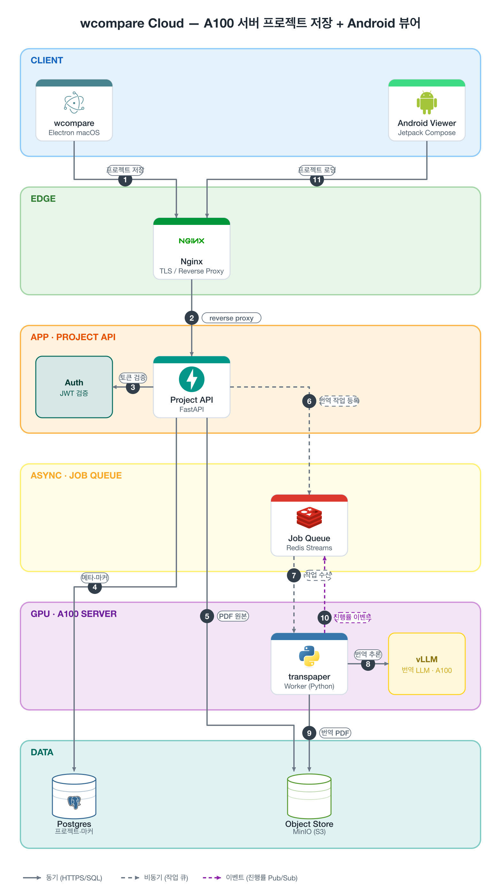

# wcompare Cloud 설계 — A100 서버 프로젝트 저장 + Android 뷰어

> **설계 문서입니다(구현 없음).** 아키텍처 다이어그램은 bytebytego-draw-architecture 스킬로 작성했으며, 스펙([spec.json](./server-android/spec.json))을 수정해 재합성할 수 있습니다. 라우팅 감사 결과: 교차 0 · 겹침 0 · 카드 관통 0.

## 0. 한눈에 보기



핵심 아이디어를 먼저 말하면: **데스크톱 wcompare가 로컬에서 하던 일(프로젝트 저장 + transpaper 번역)을 그대로 서버로 올리되, 저장은 콘텐츠 주소(content-addressed) 방식으로, 번역은 A100 위의 로컬 LLM(vLLM)으로 바꿉니다.** Android 클라이언트는 이 서버에서 프로젝트를 내려받아 보는 읽기 중심 뷰어입니다. 데스크톱과 Android가 마커를 같은 좌표계(0~1 정규화)로 공유한다는 점이 설계 전체를 관통하는 축입니다.

| 흐름 | 설명 |
|---|---|
| 1 | 데스크톱이 프로젝트(.wcproj 스냅샷 + PDF 쌍)를 HTTPS로 업로드 |
| 2 | Nginx가 TLS 종단 후 Project API로 리버스 프록시 |
| 3 | API가 JWT(JSON Web Token) 검증 |
| 4 | 프로젝트 메타데이터·마커를 PostgreSQL에 저장 |
| 5 | PDF 원본을 Object Store(MinIO)에 sha256 키로 저장 |
| 6 | 번역 요청을 Job Queue(Redis Streams)에 등록 (비동기) |
| 7 | A100 서버의 transpaper Worker가 작업 수신 |
| 8 | Worker가 vLLM(로컬 LLM 추론 서버)에 페이지 블록 번역 요청 |
| 9 | 완성된 번역 PDF를 Object Store에 저장 |
| 10 | 페이지 단위 진행률 이벤트를 큐에 발행 → API가 SSE로 클라이언트에 릴레이 |
| 11 | Android 뷰어가 프로젝트 목록·문서·마커를 내려받아 렌더 |

---

## 1. 요구사항

### 기능 요구사항

- **프로젝트 동기화**: 데스크톱에서 저장한 프로젝트(좌우 PDF + 뷰 상태 + 마커)를 서버에 올리고, 어느 기기에서든 다시 연다.
- **Android 뷰어**: 프로젝트 목록 → 열기 → 듀얼 페이지 넘김/단일 보기, 마커 표시. 1차는 읽기 전용 + 형광펜 추가까지.
- **서버 번역**: PDF를 올리면 A100에서 transpaper 파이프라인으로 번역본을 생성. 데스크톱처럼 페이지 단위 실시간 진행률 제공.
- **번역 결과 재사용**: 같은 문서를 누가 다시 올려도 재번역하지 않는다.

### 비기능 요구사항

| 항목 | 목표 |
|---|---|
| 규모 | 개인~소규모 팀: 동시 사용자 ~10, 총 사용자 ~50 |
| 문서 크기 | PDF 1개 1~200MB, 프로젝트당 2개(원문+번역) |
| 진행률 지연 | 페이지 완료 → 클라이언트 표시까지 < 1초 |
| 오프라인 | Android는 내려받은 프로젝트를 오프라인 열람 가능 |
| 보안 | 사설망 우선, 외부 노출 시 TLS + JWT. LLM 추론이 온프레미스라 문서가 외부 API로 나가지 않음(로컬 번역의 프라이버시 이점 유지) |

## 2. 용량 추정 (back-of-envelope)

- **저장**: 사용자 50 × 프로젝트 20개 × PDF 2개 × 평균 20MB ≈ **40GB** (+ 번역본 중복 제거 효과). 단일 MinIO 노드로 충분하며, 콘텐츠 주소 저장이라 같은 논문을 여러 명이 올려도 1부만 저장됩니다.
- **번역 처리량**: A100 80GB 1장에 Qwen 계열 32B(AWQ 4bit) 서빙 기준, vLLM 연속 배칭(continuous batching)으로 페이지당 2~4초. 300쪽 문서 ≈ 15~20분. 데스크톱에서 API 호출로 하던 것과 달리 **동시 문서 2~3건을 배칭으로 흡수**할 수 있는 것이 A100을 쓰는 이유입니다.
- **대역폭**: 20MB PDF 다운로드가 지배적. LAN에서는 무시 가능, 외부에서는 Nginx `sendfile`/range 요청으로 충분.
- **DB**: 마커 수천 개 × 프로젝트 수백 개 = 수십만 행. PostgreSQL 단일 인스턴스로 여유.

## 3. 컴포넌트 설계

| 컴포넌트 | 선택 | 역할과 선택 이유 |
|---|---|---|
| Nginx | edge | TLS 종단, 리버스 프록시, 대용량 PDF의 range/캐시 서빙. SSE 경로는 `proxy_buffering off` |
| Project API | FastAPI (Python) | 프로젝트 CRUD, 인증, 작업 등록, SSE 릴레이. **transpaper와 같은 언어**라 검증 로직(마커 sanitize 등)을 공유 |
| Job Queue | Redis Streams | 번역 작업 큐(컨슈머 그룹) + 진행률 채널(Pub/Sub). 소규모에 Kafka는 과잉 |
| transpaper Worker | Python, A100 호스트 상주 | 큐에서 작업을 집어 transpaper 파이프라인 실행. LLM 호출부만 vLLM 엔드포인트로 교체 |
| vLLM | OpenAI 호환 서버 | A100 1장에서 번역 LLM 서빙. 연속 배칭으로 다중 문서 동시 처리 |
| PostgreSQL | data | 사용자·프로젝트·문서·마커·번역 작업 메타 |
| MinIO | data | PDF 블롭. S3 호환이라 추후 클라우드 이전이 키 교체 수준 |

## 4. API 설계

```
POST   /api/auth/login                     → JWT 발급
GET    /api/projects                        프로젝트 목록 (커서 페이지네이션)
POST   /api/projects                        프로젝트 생성/갱신 (메타+마커, If-Match ETag)
GET    /api/projects/{id}                   메타 + 마커 + 문서 참조(sha256)
PUT    /api/projects/{id}/markers           마커만 부분 갱신 (모바일용 경량 경로)
POST   /api/documents                       PDF 업로드 (sha256 중복 시 즉시 200, 업로드 생략)
GET    /api/documents/{sha256}              PDF 다운로드 (range 지원)
POST   /api/translations                    {sha256, target:"ko"} → 작업 등록 (동일 키 결과 존재 시 즉시 완료 반환)
GET    /api/translations/{jobId}/events     SSE: {done, total, page, blocks, overflowed}
```

설계 포인트 두 가지를 짚어 둡니다.

- **업로드는 두 단계**: 클라이언트가 sha256을 먼저 보내고, 서버에 없을 때만 본문을 올립니다. 원문·번역본 쌍을 여러 프로젝트가 공유하는 구조에서 재업로드를 구조적으로 제거합니다.
- **진행률은 SSE(Server-Sent Events)**: 단방향 스트림이면 충분하고, Nginx 프록시 통과·모바일 절전 복구(자동 재접속 + `Last-Event-ID`)가 WebSocket보다 단순합니다. 데스크톱의 기존 진행률 UI(`완료/전체·경과·ETA`)는 이벤트 필드가 동일해 그대로 재사용됩니다.

## 5. 데이터 모델

```sql
users        (id, email, pw_hash, created_at)
documents    (sha256 PK, size, page_count, mime, created_at)          -- 블롭은 MinIO: blobs/<sha256>.pdf
projects     (id, owner_id→users, name, view jsonb, version, updated_at)
project_docs (project_id, side left|right, sha256→documents)
markers      (id, project_id, doc_sha256, page, kind, color, rects jsonb,
              group_id,                 -- 마커 미러링(문서쌍 공통 그룹) 대비
              updated_at, deleted bool) -- soft delete → 동기화 시 삭제 전파
translations (src_sha256, target, model_ver, status, out_sha256, stats jsonb,
              PRIMARY KEY (src_sha256, target, model_ver))             -- 결과 캐시 키
```

`.wcproj`와의 관계: 데스크톱의 `projectFile.js` 스키마(파일 쌍 + view + markers)를 그대로 서버 모델에 사상(mapping)합니다. 마커 rect가 **textLayer 기준 0~1 정규화**라는 불변식 덕분에 서버는 마커를 해석할 필요 없이 운반만 하고, Android도 같은 수치를 자기 캔버스 크기에 곱하기만 하면 됩니다. `translations`의 복합 키 `(원본 해시, 대상 언어, 모델 버전)`은 "이미 번역된 문서는 다시 번역하지 않는다"를 테이블 제약으로 보장합니다.

## 6. 딥다이브

### 6.1 번역 파이프라인: transpaper를 서버 워커로

현재 데스크톱은 transpaper CLI를 spawn해 stdout의 `page N: translated K blocks, M overflowed`를 파싱합니다. 서버화에서 바뀌는 것은 두 가지뿐입니다.

1. **LLM 백엔드 교체**: transpaper의 번역 호출부를 vLLM의 OpenAI 호환 엔드포인트(`http://localhost:8000/v1`)로 향하게 합니다. 외부 API 의존과 과금이 사라지고, 페이지 블록들을 배치로 밀어 넣어 A100의 처리량을 씁니다.
2. **진행률의 전달 경로**: Worker가 페이지를 마칠 때마다 Redis에 `XADD progress:{jobId} {done, total, page, blocks, overflowed}`. API의 SSE 핸들러가 이 스트림을 읽어 릴레이합니다. 데스크톱에서 `PYTHONUNBUFFERED=1`로 해결했던 "진행률이 끝에 몰리는" 문제와 동일한 함정이 서버에도 있으므로, Worker는 페이지 단위로 **즉시 flush**하는 것을 스펙에 명시합니다.

작업 흐름: API가 `XADD jobs`로 등록 → Worker(컨슈머 그룹)가 `XREADGROUP`으로 수신 → MinIO에서 원본 다운로드 → 번역 → 결과 업로드 → `translations` 갱신 → `XACK`. `stats jsonb`에는 페이지별 `{blocks, overflowed}`를 남겨, 데스크톱 로드맵의 "번역 상태 맵" 기능이 서버 번역본에서도 동작할 근거를 만듭니다.

### 6.2 마커 동기화: 충돌을 어떻게 다룰 것인가

마커는 성격상 **추가가 대부분이고 수정이 드문** 데이터입니다. 그래서 CRDT 같은 중장비 대신:

- 마커 id는 클라이언트 생성(현재 `mk<timestamp><seq>` 유지) — 오프라인에서 만들어도 충돌하지 않습니다.
- 동기화는 `updated_at` 기반 LWW(Last-Write-Wins, 최종 쓰기 승리) + soft delete. 같은 마커를 두 기기에서 동시에 수정하는 일은 사실상 없어 LWW의 손실 위험이 실무적으로 0에 가깝습니다.
- 프로젝트 뷰 상태(view jsonb)는 `version` 낙관적 잠금(If-Match ETag) — 충돌 시 클라이언트가 다시 읽고 재시도.

### 6.3 Android 뷰어: 렌더러 선택이 절반

| 후보 | 판정 |
|---|---|
| `android.graphics.pdf.PdfRenderer` (프레임워크 내장) | 텍스트 레이어·내부 링크·검색이 없음 → 부적합 |
| **pdfium 기반 (pdfium-android)** | **채택.** 비트맵 렌더 + 텍스트 추출 API, Chrome과 같은 엔진 |
| WebView + pdf.js | 데스크톱과 코드 공유 가능하지만 대용량에서 메모리·성능 불리 → 보류 |

구성: Kotlin + Jetpack Compose, 페이지 비트맵은 pdfium으로 렌더해 `LazyColumn`(세로 스크롤) 또는 `HorizontalPager`(페이지 넘김)에 배치. **마커는 페이지 비트맵 위 Compose `Canvas`에 0~1 rect × 페이지 크기로 그립니다** — 데스크톱과 좌표계를 공유하므로 변환 코드가 없습니다. 듀얼 보기는 태블릿 가로에서만 좌우 2-pane, 폰에서는 단일 문서 + "원문↔번역 전환" 버튼(같은 페이지 유지 — 좌표 동형성 덕분에 페이지 번호만 유지하면 됩니다).

오프라인: Room에 프로젝트 메타·마커를, 파일은 sha256 키로 디스크 캐시. 키가 콘텐츠 해시라 **캐시 무효화 문제가 원천적으로 없습니다**(내용이 바뀌면 키가 바뀝니다). 오프라인 중 추가한 형광펜은 로컬 큐에 쌓았다가 재접속 시 `PUT markers`로 밀어 올립니다(6.2의 id 정책 덕분에 안전).

### 6.4 왜 A100인가

- 80GB HBM: 32B급 모델 AWQ 양자화 + 넉넉한 KV 캐시 → 긴 페이지 블록의 동시 배칭.
- 번역 품질/속도 트레이드오프를 모델 교체(7B↔32B↔72B)로 조절 — `model_ver`가 캐시 키에 있어 모델 업그레이드 시 기존 결과와 공존합니다.
- 유휴 시간에는 같은 vLLM으로 로드맵의 다른 기능(용어집 자동 추출, 요약)을 서빙할 여지.

## 7. 장애 모드와 트레이드오프

| 상황 | 대응 |
|---|---|
| Worker 사망(번역 중) | Redis Streams pending 목록 + `XAUTOCLAIM`으로 다른/재시작 Worker가 인계. 페이지 단위 재개는 2차(1차는 문서 단위 재실행) |
| vLLM OOM/행 | Worker가 헬스체크 후 작업을 큐에 반납, 지수 백오프. 큐 깊이 상한으로 폭주 차단 |
| 업로드 중단 | sha256 기반이라 재시도가 곧 이어올리기(동일 키 재개) |
| SSE 끊김(모바일 절전) | `Last-Event-ID` 재접속 + 최신 상태는 `GET /translations/{jobId}`로 폴백 |
| 저장소 손상 | 다운로드 시 sha256 재검증. MinIO는 단일 노드 + 일일 스냅샷(소규모 전제) |

**의도적으로 선택한 단순함** — 규모 전제(동시 ~10명)가 바뀌면 재검토합니다:

- Kafka 대신 Redis Streams (운영 부담 1/10)
- 마이크로서비스 대신 단일 API 프로세스 (배포 단위 1개)
- CRDT 대신 LWW + soft delete (마커의 실사용 패턴에 충분)
- WebSocket 대신 SSE (단방향으로 충분, 프록시·재접속 단순)

## 8. 이행 단계 (참고)

1. **P0**: documents/projects API + MinIO + Postgres — 데스크톱 `project.js`에 "서버로 저장" 경로 추가만으로 왕복 성립
2. **P1**: 번역 큐 + Worker + vLLM + SSE — 데스크톱 번역 버튼에 "서버에서 번역" 옵션
3. **P2**: Android 뷰어(읽기 전용 → 형광펜 추가)
4. **P3**: 용어집·번역 상태 맵 등 로드맵 기능의 서버 확장
